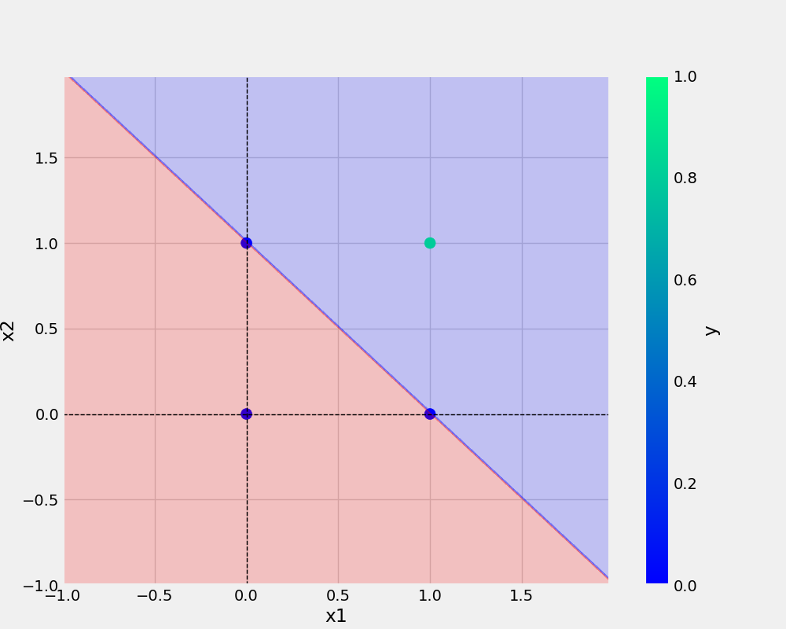
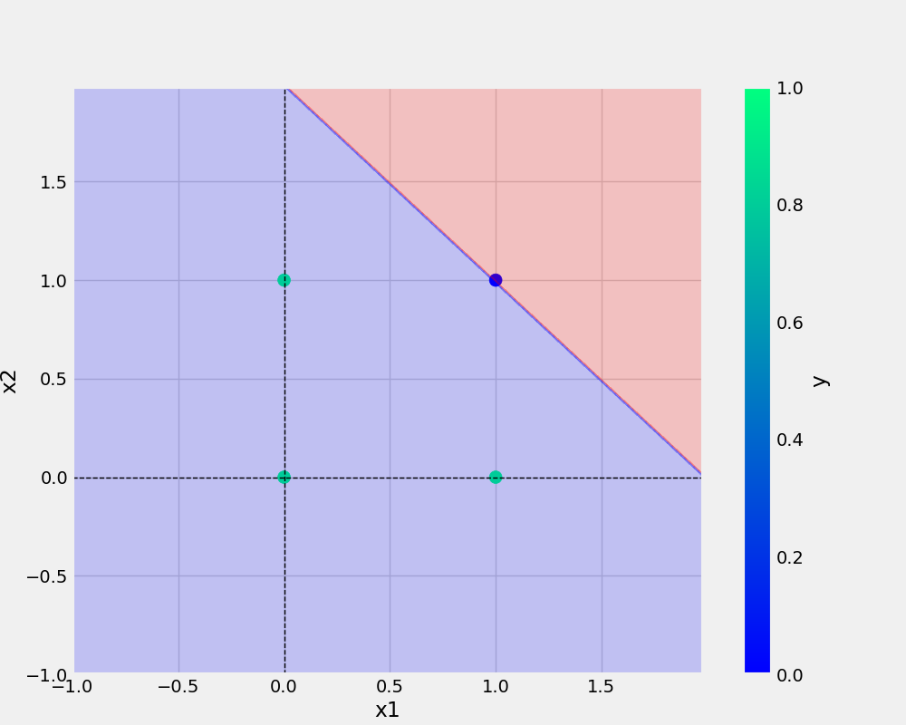
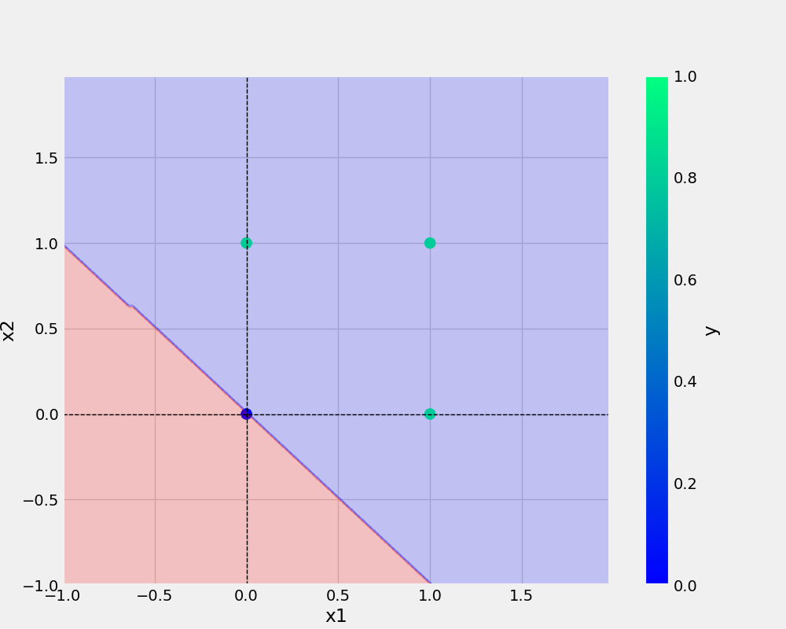
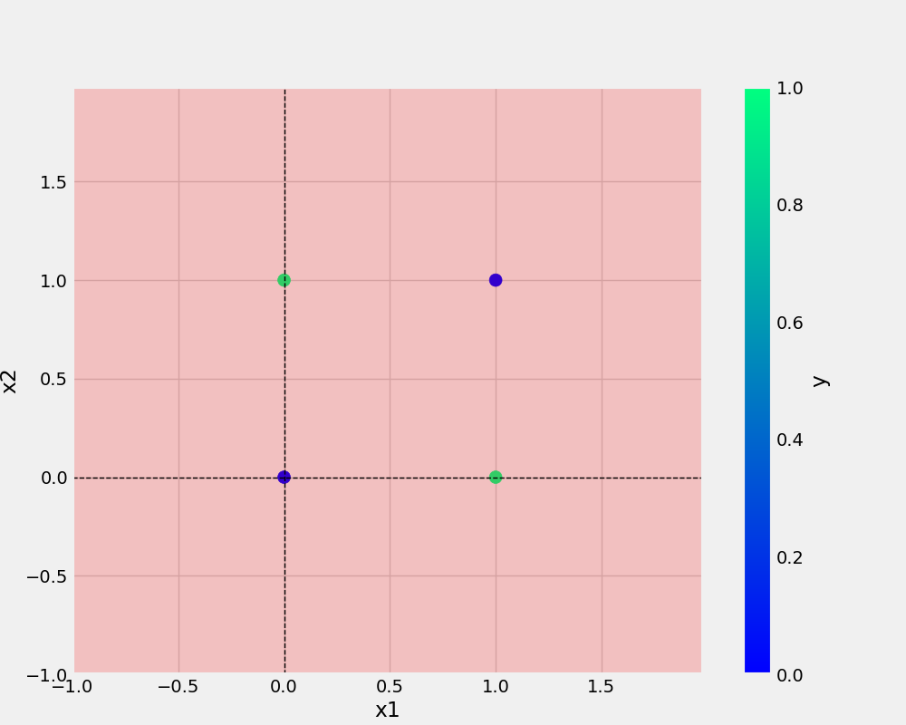

# 1NeuronPerceptron
1Neuron | Perceptron

## dataset used

### AND
x1 | x2 | y
-|-|-
0|0|0
0|1|0
1|0|0
1|1|1

### OR
x1 | x2 | y
-|-|-
0|0|0
0|1|1
1|0|1
1|1|1

### XOR
x1 | x2 | y
-|-|-
0|0|0
0|1|1
1|0|1
1|1|0

### NAND
x1 | x2 | y
-|-|-
0|0|1
0|1|1
1|0|1
1|1|0

# Result Analysis

## And image -


## nand image -


## or image -


## XOR image -



# Instruction
```bash
git clone https://github.com/mdnazmulislam0087/1NeuronPerceptron.git

```
