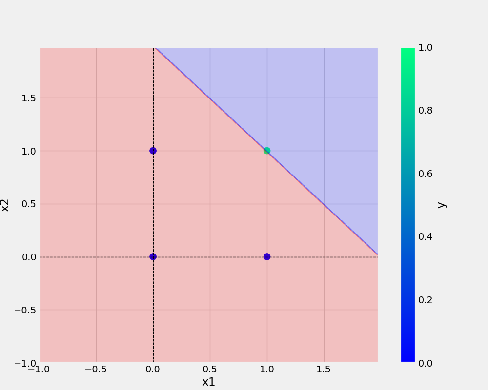
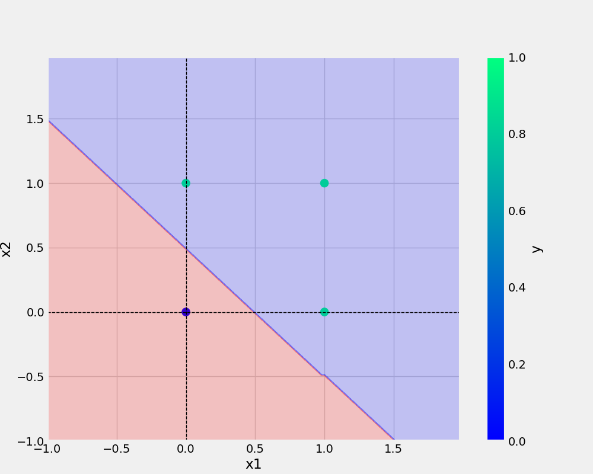

# 1NeuronPerceptron
1Neuron | Perceptron

## How to use this
## First clone the repository-

```bash

https://github.com/mdnazmulislam0087/1NeuronPerceptron.git

```
## Create a new environment and use below code to install dependencies-
``` bash
pip install -r requirements.txt
```

## Run below codes one by one and
### For and Gate 

``` bash
python and.py

```
### For OR Gate 
``` bash
python or.py

```
### For XOR Gate 
```bash
python xor.py
```
### For NAND Gate 
```bash
python nand.py
```


## dataset used

### AND
x1 | x2 | y
-|-|-
0|0|0
0|1|0
1|0|0
1|1|1

### OR
x1 | x2 | y
-|-|-
0|0|0
0|1|1
1|0|1
1|1|1

### XOR
x1 | x2 | y
-|-|-
0|0|0
0|1|1
1|0|1
1|1|0

### NAND
x1 | x2 | y
-|-|-
0|0|1
0|1|1
1|0|1
1|1|0

# Result Analysis

## And image -


## nand image -


## or image -


## XOR image -


# Get the Pypi Package of oneNeuronPerceptron in the below link
[Pypi Package one Neuron](https://github.com/mdnazmulislam0087/1NeuronPerceptron_Pypi)
